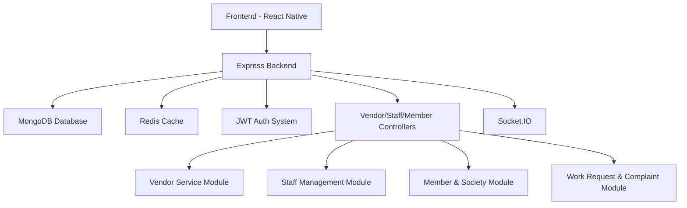
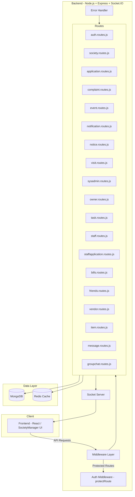

# 🏢 SocietyManager — Backend

**SocietyManager** is a robust backend system designed to streamline **residential society management** — from handling residents, staff, and vendors to managing complaints, billing, events, notifications, and real-time communication.  
Built with scalability, modularity, and real-time capabilities at its core.

---

## ⚙️ Tech Stack

- 🟢 **Node.js + Express.js**
- 🍃 **MongoDB (Mongoose ORM)**
- 🔥 **Redis** — caching & optimization
- ⚡ **Socket.IO** — real-time messaging
- 🔐 **JWT Authentication** — secure, role-based access
- ⏲ **BackGround Jobs** — **BullMq** for background jobs
- 🔔 **Notifications with google cloud messaging (fcm)**

---

## 📁 Project Structure
```
backend/
├── controllers/ # Business logic for each module
├── routes/ # API route definitions
├── models/ # Mongoose schemas
├── middleware/ # Auth, error, validation
├── lib/ # Socket, DB, Redis connections
├── utils/ # Helpers and constants
├── server.js # Entry point
└── .env # Environment variables
```

---


## 🚀 Features

### 👥 Members & Authentication
- JWT-based authentication with secure cookie storage.  
- Member registration & login.  
- Role-based access (Admin, Member, Vendor).  
- Profile management.

### 🏢 Society Management
- Create and manage societies.  
- Add blocks, flats, and link members.  
- Assign admins and manage roles.

### 🧾 Notices & Announcements
- Admins can post notices.  
- Members get updates instantly via dashboard.  
- Expiry-based filtering for active/archived notices.

### 🧰 Vendor & Work Management
- Vendors can register and offer services.  
- Societies can create **work requests** and assign vendors.  
- Status tracking for each request (Pending → In Progress → Completed).  
- Vendor availability and service type management.

### 💼 Staff System
- Add & manage staff (security, cleaners, etc).  
- Attendance tracking and role allocation.  

### 💬 Complaints & Feedback
- Members can raise issues with categories & attachments.  
- Admins can mark status and resolve complaints.

### 💰 Payment & Bill Tracking 
- Integration-ready for online/offline payments and bill tracking.  

### ⚡ Performance & Reliability
- Redis caching for fast data retrieval.  
- Background jobs for heavy tasks.  
- Modular route-based backend structure for scalability.

---

## 🧩 API Routes Overview

| Base Route | Protected | Description |
|-------------|------------|-------------|
| `/api/v0/auth` | ❌ | Authentication & user management |
| `/api/v0/society` | ❌ | Society registration & info |
| `/api/v0/application` | ❌ | Membership & join applications |
| `/api/v0/complaints` | ✅ | Resident complaint system |
| `/api/v0/events` | ✅ | Society events management |
| `/api/v0/notifications` | ❌ | Notification fetching |
| `/api/v0/notice` | ✅ | Notices from admin/owners |
| `/api/v0/visit` | ✅ | Visitor logging & approvals |
| `/api/v0/sysAdmin` | ✅ | System-level admin operations |
| `/api/v0/ownerAccess` | ✅ | Owner privileges & actions |
| `/api/v0/task` | ✅ | Task assignment & progress |
| `/api/v0/staff` | ✅ | Staff management & tracking |
| `/api/v0/staffApplication` | ✅ | Staff hiring applications |
| `/api/v0/bills` | ❌ | Billing & society payments |
| `/api/v0/friends` | ✅ | Friend system for users |
| `/api/v0/vendor` | ✅ | Vendor management system |
| `/api/v0/item` | ❌ | Item/service listings |
| `/api/v0/message` | ✅ | 1-on-1 chat messages |
| `/api/v0/groupchat` | ✅ | Group chat communication |

✅ = Requires JWT via `protectRoute` middleware  
❌ = Public access (auth handled inside routes)

---


## 🧠 System Overview (Mermaid Diagram)



---

## ⚙️ Environment Variables

Create a `.env` file in the root with:

```bash
#basic env variables
PORT=5000
MONGODB_URI=
JWT_SECRET=
UPSTASH_REDIS_URL=


#cloudinary image upload env variables
CLOUDINARY_CLOUD_NAME=
CLOUDINARY_API_KEY=
CLOUDINARY_API_SECRET=

#email env variables
EMAIL_USER=
EMAIL_PASS=

#sms env variables ( can use twilio too i am using text bee)
TEXT_BEE_API=
TEXT_BEE_DEVICEID=

#workflow
APP_URl=
QSTASH_TOKEN=

#razorpay env variables
RAZORPAY_KEY_ID=
RAZORPAY_KEY_SECRET=
RAZORPAY_WEBHOOK_SECRET=

#firebase messages env variables
FIREBASE_SERVICE_ACCOUNT_JSON=

```
---

## 🧠 Installation & Setup

```bash
# Clone the repo
git clone https://github.com/Raj-dev08/SocietyManager.git
cd SocietyManager/backend

# Install dependencies
npm install

# Setup environment variables
cp .env.example .env   # if you have one or create manually

# Run in development
npm run dev

# Run in production
npm start
```

---

## 🏗 Architecture  
